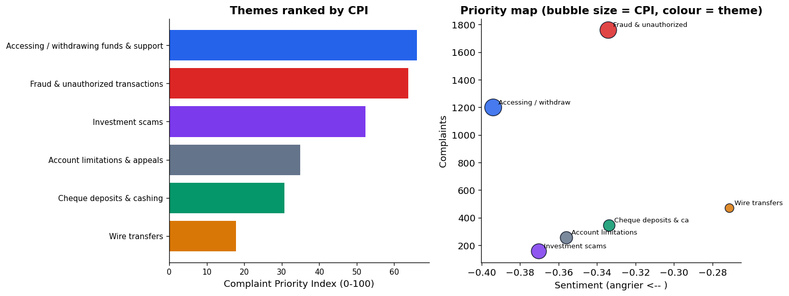

# An NLP Analysis of Consumer Financial Complaints

A domain-aware NLP study of digital-payment complaints. The point is not that sentiment and topic
modelling can be run, it is that the **modelling decisions are made explicitly and defended**: how
the vocabulary is built, how the number of topics is chosen, and why a generic sentiment tool is the
wrong instrument for financial text.

**Skills shown:** text mining, topic modelling with principled model selection (coherence + balance),
domain-specific sentiment modelling benchmarked against a baseline, temporal analysis, and the
judgement to read model output critically.
**Stack:** Python, pandas, scikit-learn (TF-IDF, NMF), NLTK (VADER), Hugging Face Transformers
(FinBERT), matplotlib.

> Built on fully public data. No confidential or employer data is used. Company names are
> deliberately excluded so the analysis is about problems, not providers.

---

## What makes this more than a tutorial

Most complaint-NLP projects stop at "here are some topics and here is the sentiment." The value is in
the decisions and in going past description, and this project shows its work on six of them:

1. **Vocabulary construction is deliberate.** Three layers of stop-words (standard, generic filler,
   and company names removed on purpose), n-grams so "wire transfer" survives, and `min_df` / `max_df`
   thresholds chosen to cut noise and over-common words. Nothing is dumped into a black box.
2. **The number of topics is chosen, not guessed.** Topic coherence is measured across a range of k.
   It peaks at k=5, but at k=5 a single catch-all topic swallows 72% of complaints and is useless. The
   final choice (k=7) balances coherence against actionable separation. Reconstruction error is shown
   to be the wrong criterion (it always favours more topics).
3. **Sentiment is done for the domain.** VADER, the usual baseline, labels 38% of these complaints
   *positive*, because angry customers write politely ("Dear Support Team, I hope this finds you
   well..."). **FinBERT**, a model fine-tuned on financial text, disagrees on 25% of complaints and is
   correct on inspection. Tool choice changes the business conclusion, not just the numbers.
4. **An original decision metric.** I define a **Complaint Priority Index (CPI)** combining volume,
   domain sentiment, and how rarely a theme is resolved. It reorders priorities that volume alone
   misses, moving fund-access above fraud and lifting investment scams from smallest theme to third.
5. **From description to prediction.** A logistic-regression model predicts which complaints win
   *relief* vs. only an explanation, and reads out the drivers: concrete disputes (frozen funds, held
   balances) tend to be resolved; scams and verification problems tend not to be.
6. **The findings are read critically.** One topic is openly flagged as low-coherence noise, the
   sentiment anomaly is explained with evidence, and the modest predictive power is stated honestly.

## Headline findings

- **The politeness trap:** a generic sentiment tool calls 38% of these complaints positive and
  misranks them; a finance-domain model corrects it on 25% of complaints.
- **The Complaint Priority Index reorders the picture:** *accessing and withdrawing funds* is the top
  priority (highest volume-weighted anger, low resolution), and *investment scams* rise to third
  despite low volume, because only **6.4% of scam complaints win any relief** (vs 15.7% overall).
- **Relief is predictable in direction:** concrete disputes get resolved; scams and verification
  problems rarely do.

## Deliverables

| Asset | What it is |
|---|---|
| `report.md` | A professional written analysis report (executive summary, methodology, findings, recommendations) |
| `dashboard/index.html` | A **self-contained interactive dashboard app**. Live filters (year range, sentiment model, outcome). |
| `complaints-nlp-analysis.ipynb` | The full reproducible notebook: code, explanations, charts |
| `notebook.py` | The notebook as a plain script (easy to read/diff) |

## Key visual: the priority map

Each theme placed by volume against sentiment, bubble size = CPI, colour = relief rate.



## The data

Public complaints from the **US CFPB Consumer Complaint Database**, product category *"Money transfer,
virtual currency, or money service"* with a written narrative. 4,282 complaints, 2017 to 2024,
accessed via the `BEE-spoke-data/consumer-finance-complaints` mirror on Hugging Face. The CFPB is a
US federal agency that publishes these complaints publicly, so no confidentiality applies.

## Run it yourself

```bash
python3 -m venv .venv
source .venv/bin/activate
pip install -r requirements.txt
python -c "import nltk; nltk.download('vader_lexicon'); nltk.download('stopwords')"
jupyter notebook complaints-nlp-analysis.ipynb
```

FinBERT scores are cached in `data/finbert_scores.csv`, so the notebook runs top to bottom in
seconds. Delete that file to regenerate them from scratch (about 5 minutes on CPU); the code path is
in the notebook.

## Files

| File | What it is |
|---|---|
| `report.md` | Professional written analysis report |
| `dashboard/index.html` | Self-contained interactive dashboard |
| `build_dashboard.py` | Regenerates the dashboard from the data |
| `complaints-nlp-analysis.ipynb` | The analysis: explanations, code, charts |
| `notebook.py` | The same notebook as a plain script (easy to read/diff) |
| `data/complaints_money_transfer.csv` | The public complaint subset |
| `data/finbert_scores.csv` | Cached FinBERT sentiment scores |
| `figures/` | Exported charts |

## Limitations

FinBERT is trained on financial news, not complaints specifically, so it is a strong proxy rather than
ground truth; NMF gives soft themes read with judgement (one cluster here is genuinely noise); and a
complaints database reflects people motivated enough to file formally, not all customers. A production
version would fine-tune a sentiment model on labelled complaint text and tune the topic count further.

---

*Data: public CFPB Consumer Complaint Database. No confidential or employer data was used.*
